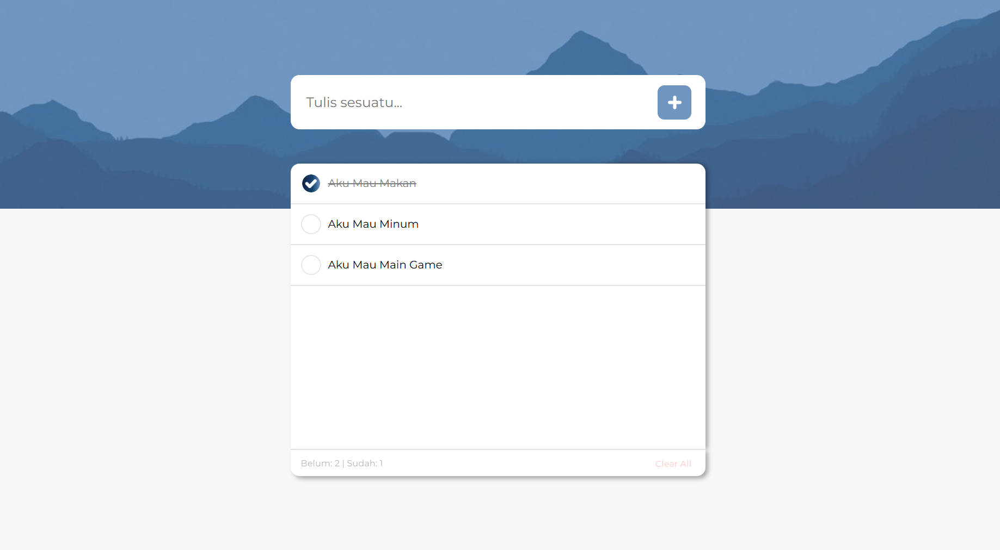

# ✅ To-Do List App

A simple, sleek, and super helpful task manager built to help you stay productive and focused (dan nggak rebahan mulu 🛋️✨). Whether you're tracking daily chores, school assignments, or world domination plans—this To-Do app has your back! 💼🧠🔥

## 🌟 Fitur Utama

- ✍️ Tambah, edit, dan hapus tugas
- ✅ Tandai tugas yang sudah selesai
- 🕒 Tampilkan tugas berdasarkan status (Selesai / Belum)
- 💾 Data tersimpan secara lokal (atau bisa diintegrasi ke backend nanti)

## 📸 Preview
 


## 🚀 Cara Menjalankan

1. Clone repo ini:
   ```bash
   git clone https://github.com/username/todo-app.git
